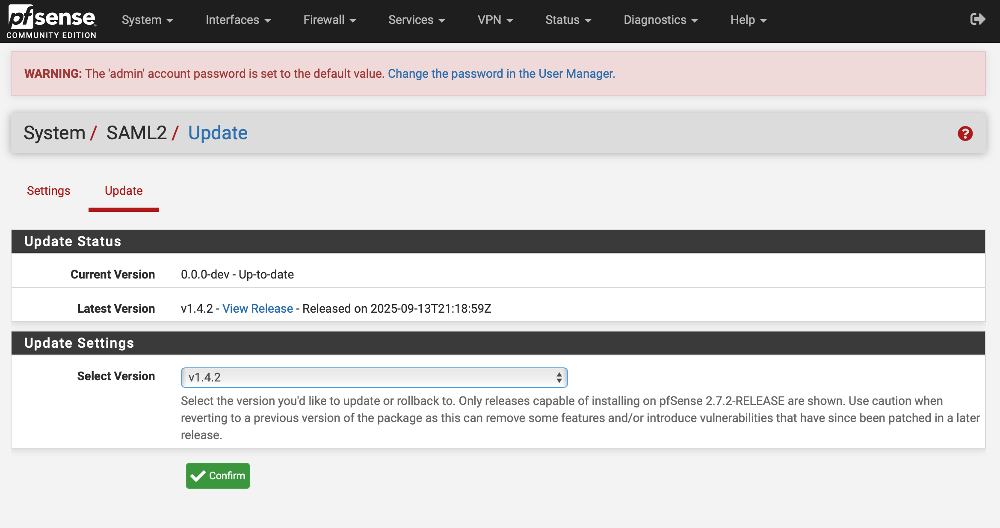

# Installation

## Installing the Package

To install pfSense-pkg-saml2-auth, simply run the following command in your pfSense shell:

```shell
pkg-static add https://github.com/pfrest/pfSense-pkg-saml2-auth/releases/latest/download/pfSense-2.8-pkg-saml2-auth.pkg
```

!!! Important
    - You may need to customize the installation command to reference the package built for your pfSense version. Check the [releases page](https://github.com/pfrest/pfSense-pkg-saml2-auth/releases) to find the package built for your version of pfSense.
    - When updating pfSense, **you must reinstall this package afterward** as pfSense removes unofficial packages during system updates and has no way to automatically reinstall them.
    - If you're looking for a method of programmatically installing the package without SSH, check out [pfsense-vshell](https://github.com/pfrest/pfsense-vshell)!

## Updating the Package

There are several ways to update the package to a newer version:

### Using the Web Interface

After the initial installation, a pfSense webConfigurator page for the package will be available under System > SAML2.
On this page, there will be an update tab you can use to update the package to the latest version. This page will only
show updates available for your version of pfSense.



### Using the Command Line Interface

After the initial installation, the `pfsense-saml2` command line too is available to manage various aspects of the package.
To update the package to the latest version available for your version of pfSense, simply run:

```shell
pfsense-saml2 update
```

### Using Manual Commands

You can also manually update the package using the `pkg-static` command. This method is useful if you encounter issues with the other update options:


```shell
pkg-static delete -y pfSense-pkg-saml2-auth
pkg-static add https://github.com/pfrest/pfSense-pkg-saml2-auth/releases/latest/download/pfSense-2.8-pkg-saml2-auth.pkg
```

!!! Note
    - Make sure to replace the URL with the appropriate one for your pfSense version.

## Reverting a Package Update

If you need to revert to an older version of a package, or update to a specific version other than latest, the package
provided multiple options for doing so:

### Using the Web Interface

Just the like updating the package, you can revert to a previous version using the webConfigurator page at System > SAML2.
On the update tab, there is a dropdown to select which version you want to install. This page will only show versions
available for your version of pfSense.


### Using the Command Line Interface

After the initial installation, the `pfsense-saml2` command line too is available to manage various aspects of the package.
To revert the package to a specific version, simply run:

```shell
pfsense-saml2 revert <version>
```

!!! Note
    You can only revert to versions available for your version of pfSense.

### Using Manual Commands

You can also manually revert the package using the `pkg-static` command. This method is useful if you encounter issues with the other revert options:

```shell
pkg-static delete -y pfSense-pkg-saml2-auth
pkg-static add https://github.com/pfrest/pfSense-pkg-saml2-auth/releases/download/<version>/pfSense-2.8-pkg-saml2-auth.pkg
```

!!! Note
    - Make sure to replace the URL with the appropriate one for your pfSense version and the version you want to install.

## Uninstalling the Package

To uninstall the package, simply run the following command in your pfSense shell:

```shell
pkg-static delete -y pfSense-pkg-saml2-auth
```

Please note that uninstalling the package will not remove any applicable cache or log files. If you want to remove
these files as well, you can run the following commands as well:

```shell
rm -rf /var/cache/pfSense-pkg-saml2-auth
rm /var/log/saml2.log
```