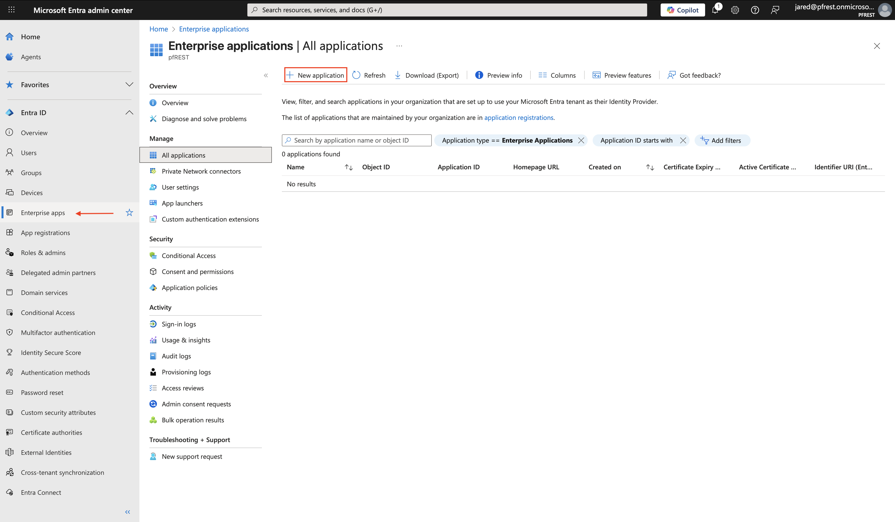
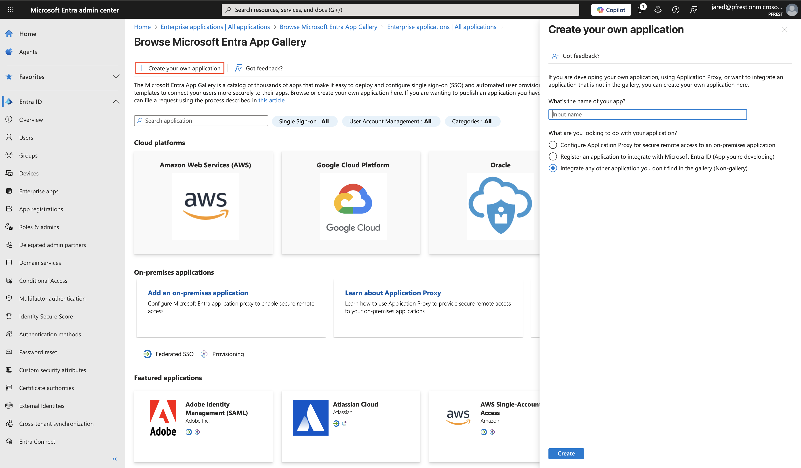
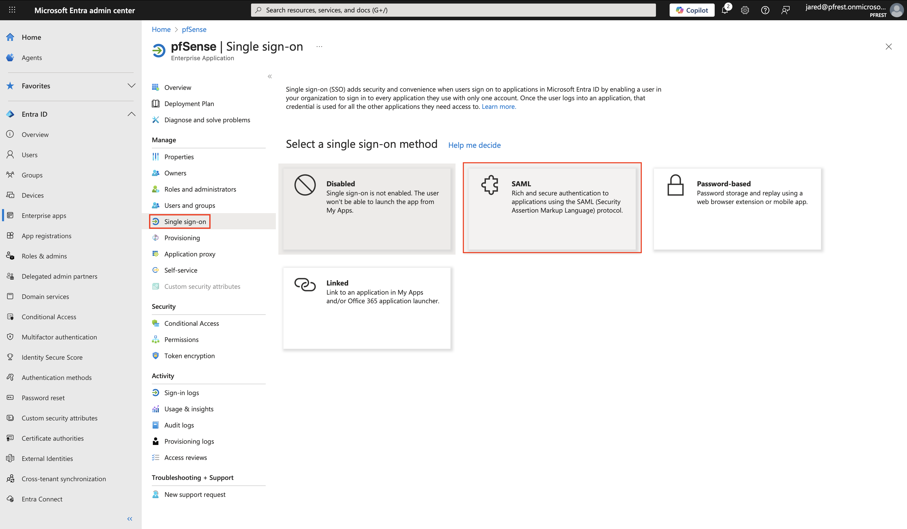
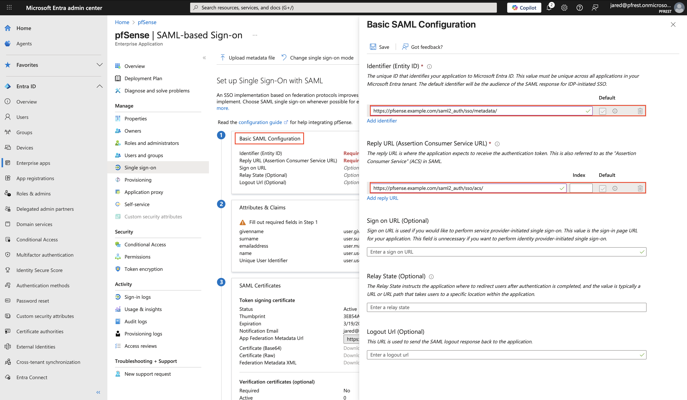
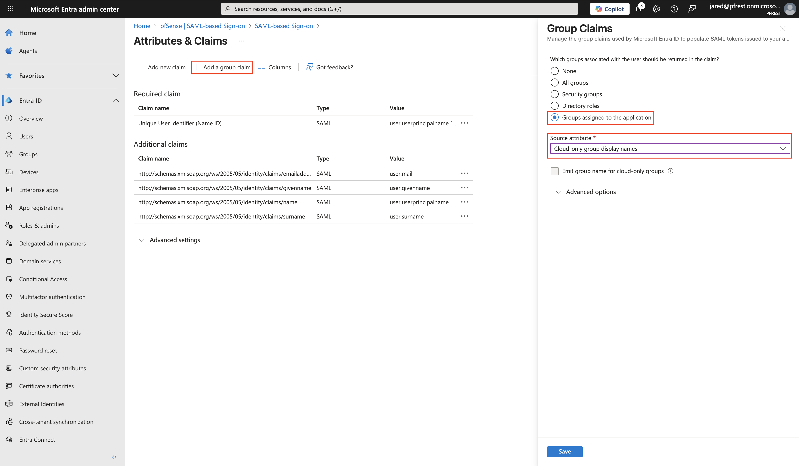
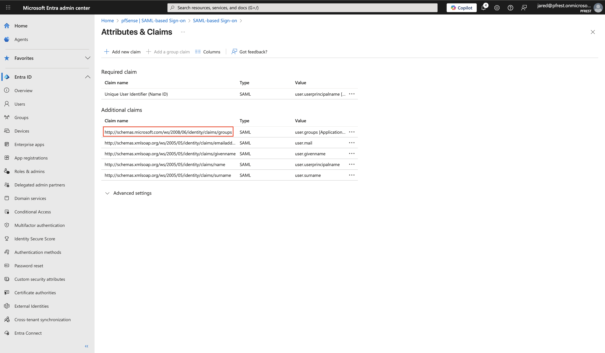
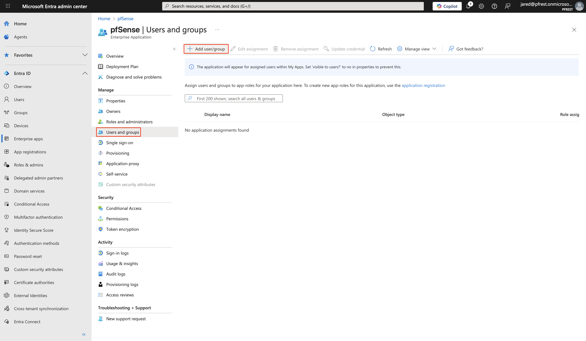
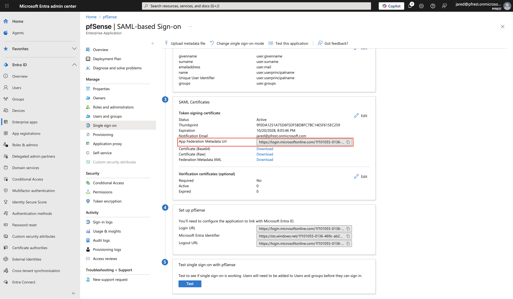
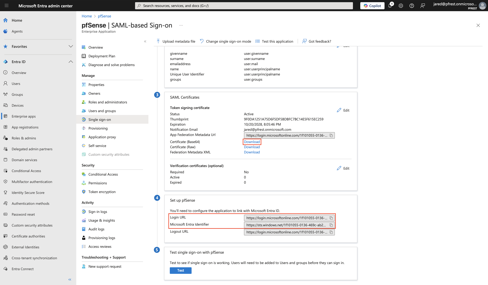
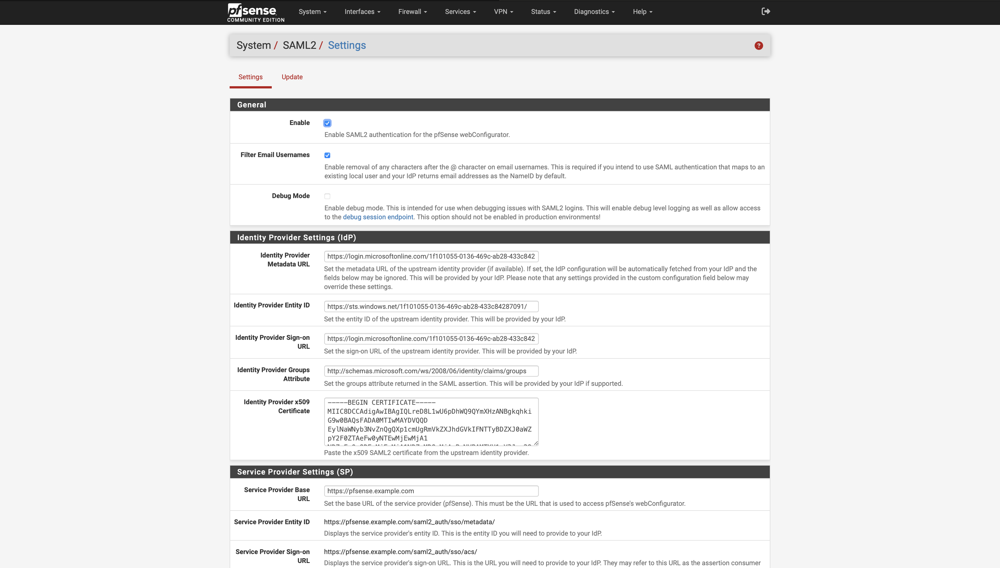

# Microsoft Entra

This guide will walk you through configuring pfSense to use Microsoft Entra for webConfigurator authentication via SAML 
2.0. This allows your users to log into pfSense using Microsoft Entra, centralizing access and enabling features like MFA.

## Prerequisites

- A pfSense instance with the [SAML2 package installed](../INSTALLATION.md)
- A Microsoft Entra account with admin privileges

## Step 1: Register a new application in Microsoft Entra

After logging into your Microsoft Entra admin center, navigate to **Entra ID > Enterprise apps** and click the **New
application** button. Then select the **New application** option.

On the next page, click the **Create your own application** option at the top. Give your application a name
(e.g., "pfSense") and select the **Integrate any other application you don't find in the gallery (Non-gallery)** option.

## Step 2: Configure SAML settings

Once the application is created, navigate to the **Single Sign-on** section and select the **SAML** option.

In the **Basic SAML Configuration** section, click the **Edit** button to configure the following settings:

- **Identifier (Entity ID)**: `https://<pfsense_ip_or_hostname>/saml2_auth/sso/metadata/`
- **Reply URL (Assertion Consumer Service URL)**: `https://<pfsense_ip_or_hostname>/saml2_auth/sso/acs/`

## Step 3: Configure group claims

!!! Note
    If you are using [user-based privilege mapping](../PRIVILEGE_MAPPING_BY_USER.md), you can skip this step.

If you are planning on using [group-based privilege mapping](../PRIVILEGE_MAPPING_BY_GROUP.md), you must configure a 
group claim to return the SSO user's group memberships. To do this, scroll down to the **Attributes & Claims** section 
and click the **Edit** button. On the claims page, click the **Add a group claim** button and select the **Groups assigned
to the application** option. Under **Source attribute**, select the option that best fits your needs and environment. In
this example, we will use the **Cloud-only group display names** option as we are only using cloud-based groups, not
synchronized on-premises AD groups.

Once the claim has been added, make note of the **Claim name** as you will need it later when configuring pfSense.

## Step 4: Assign users or groups to the application

Click the **Users and groups** section on the left-hand side, then click the **Add user/group** button to assign users
or groups to the application so they can authenticate to pfSense.

## Step 5: Obtain Microsoft Entra metadata

Next, you will need to obtain the Microsoft Entra SAML metadata to configure pfSense. Navigate back to the 
**Single Sign-on** section of the application. If you are planning on using the IdP metadata URL for auto-configuration in
pfSense, make note of the **App Federation Metadata Url** under the **SAML Certificates** section.

If you prefer to manually configure the IdP's metadata in pfSense, click the **Download** link next to the
**Certificate (Base64)** option to download the IdP signing certificate. Then, make note of the **Login URL** and
**Microsoft Entra Identifier** values as you will need them to complete the manual configuration in pfSense.

## Step 6: Configure SAML2 settings in pfSense

Now that you have the necessary information from Microsoft Entra, sign in to your pfSense instance and navigate to
**System > SAML2**. Ensure the following fields are set:

- **Enable**: Checked
- **Filter Email Usernames**: Checked
- **Identity Provider Metadata URL**: The __App Federation Metadata Url__ from [Step 5](#step-5-obtain-microsoft-entra-metadata) if using auto-configuration.
- **Identity Provider Single Sign-On URL**: The __Login URL__ from [Step 5](#step-5-obtain-microsoft-entra-metadata) if not using a metadata URL.
- **Identity Provider Entity ID**: The __Microsoft Entra Identifier__ from [Step 5](#step-5-obtain-microsoft-entra-metadata) if not using a metadata URL.
- **Identity Provider Groups Attribute**: The __Claim name__ from [Step 3](#step-3-configure-group-claims) if using group-based privilege mapping.
- **Identity Provider x509 Certificate**: The contents of the downloaded __Certificate (Base64)__ file from [Step 5](#step-5-obtain-microsoft-entra-metadata) if not using a metadata URL.
- **SP Base URL**: `https://<PFSENSE IP OR FQDN>`

## Step 7: Create users or groups in pfSense

If you are using [group-based privilege mapping](../PRIVILEGE_MAPPING_BY_GROUP.md), navigate to **System > User
Manager > Groups** and create remote-scoped groups that match those in Microsoft Entra. Ensure the group names match exactly,
including case sensitivity. Then assign the desired privileges to each group.

If you are using [user-based privilege mapping](../PRIVILEGE_MAPPING_BY_USER.md), navigate to
**System > User Manager> Users** and create local users that match the usernames in Microsoft Entra exactly. Assign the desired
privileges to each user.

!!! Tip
    If you selected a different source attribute for group claims in [Step 3](#step-3-configure-group-claims), ensure 
    that the group names in pfSense match the values being sent. In some cases, Microsoft Entra may send group IDs instead 
    of group names.

## Step 8: Test the configuration

On the pfSense login page, there should now be a **Sign In with SSO** link below the standard login form. Click this
link to be redirected to Microsoft Entra for authentication. Assuming everything is configured correctly, you should be redirected
back to pfSense and be logged in. If you encounter issues, you can enable the **Debug** option on the **System > SAML2**
page to enable more detailed logging. The SAML2 logs can be found under **Status > System Logs > Packages > SAML2**.

Last updated: 2025-10-20