# Okta

This guide will walk you through configuring pfSense to use Okta for webConfigurator authentication via SAML 2.0. 
This allows your users to log into pfSense using Okta, centralizing access and enabling features like MFA.

## Prerequisites

- A pfSense instance with the [SAML2 package installed](../INSTALLATION.md)
- An Okta account with admin privileges

## Step 1: Create a new application in Okta

After logging into your Okta admin console, navigate to **Applications > Applications** and click 
**Create App Integration**.

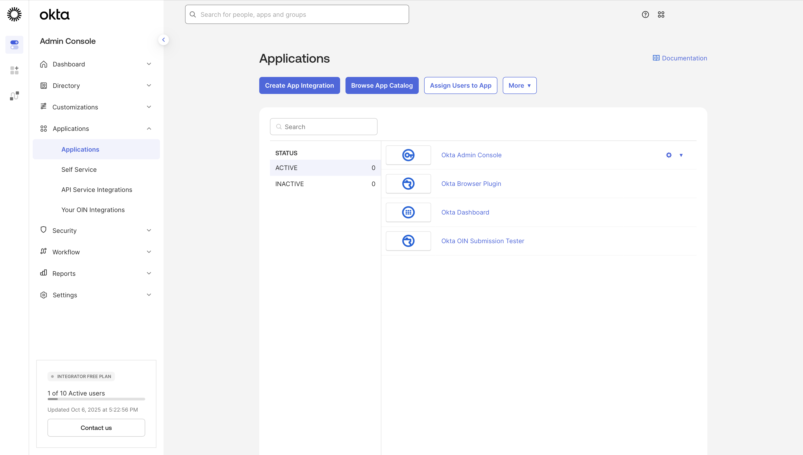

When prompted, select **SAML 2.0** as the sign-in method and click **Next**.

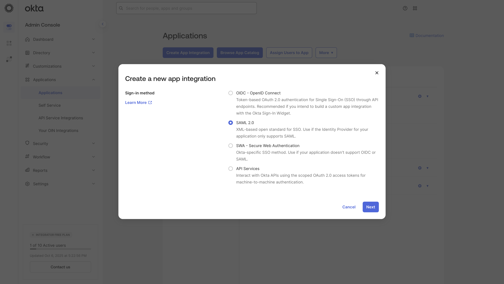

Give your application a name (e.g., "pfSense") and optionally upload a logo. Click **Next** to proceed.

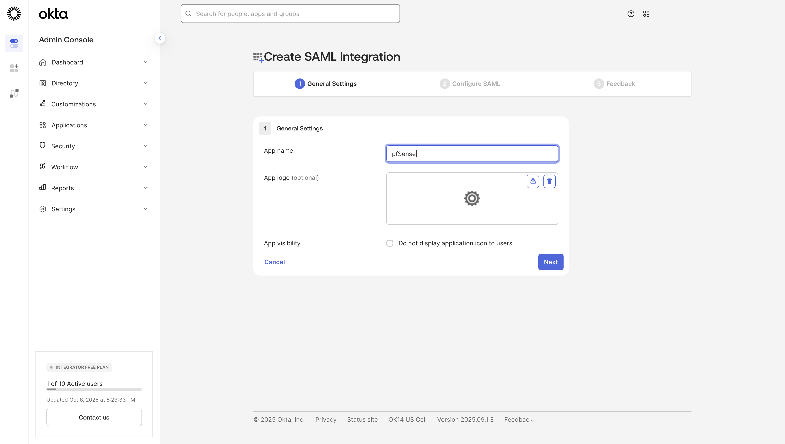

On the next screen, you will configure the SAML settings to direct Okta to your pfSense instance. Set the following
fields:

- **Single sign-on URL**: `https://<PFSENSE IP OR FQDN>/saml2_auth/sso/acs/`
- **Audience URI (SP Entity ID)**: `https://<PFSENSE IP OR FQDN>/saml2_auth/sso/metadata/`

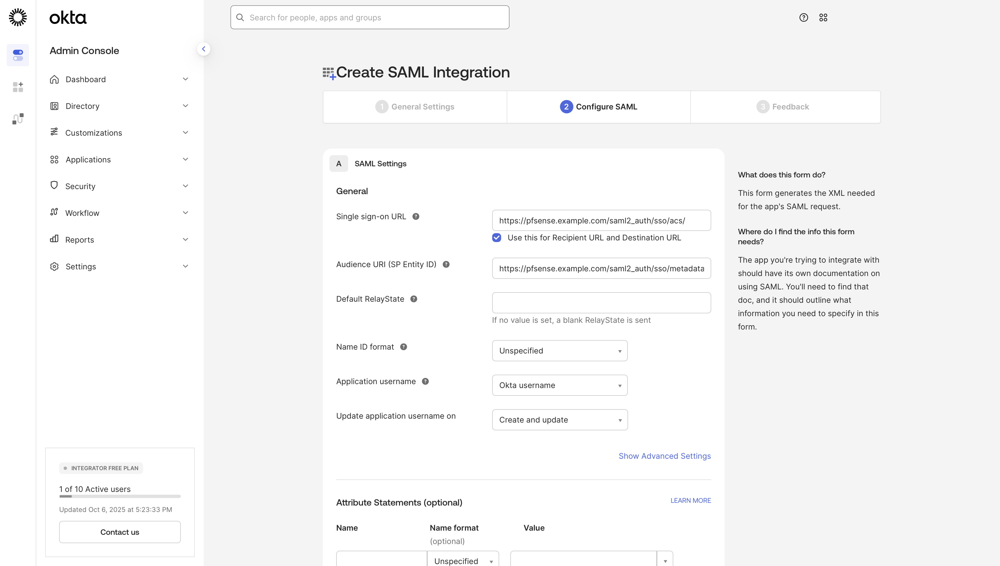

!!! Important
    You must ensure the **Audience URI (SP Entity ID)** matches the **SP Entity ID** field in pfSense exactly. If you
    change the SP Entity ID in pfSense, you must also update it here in Okta.

If you are not planning on utilizing [group-based privilege mapping](../PRIVILEGE_MAPPING_BY_GROUP.md), you can
skip to [Step 3](#step-2-assign-users-or-groups-to-the-application). Otherwise, scroll down to the **Group Attribute 
Statements** section and add a new attribute with the following values:

- **Name**: `groups`
- **Name format**: `Unspecified`
- **Filter**: Choose the filter that best suits your requirements. If you want to send all groups the user is a member 
  of, select `Matches regex` and enter `.*`. If you want to only send specific groups, choose `Starts with` or `Equals`
  and enter the appropriate value.

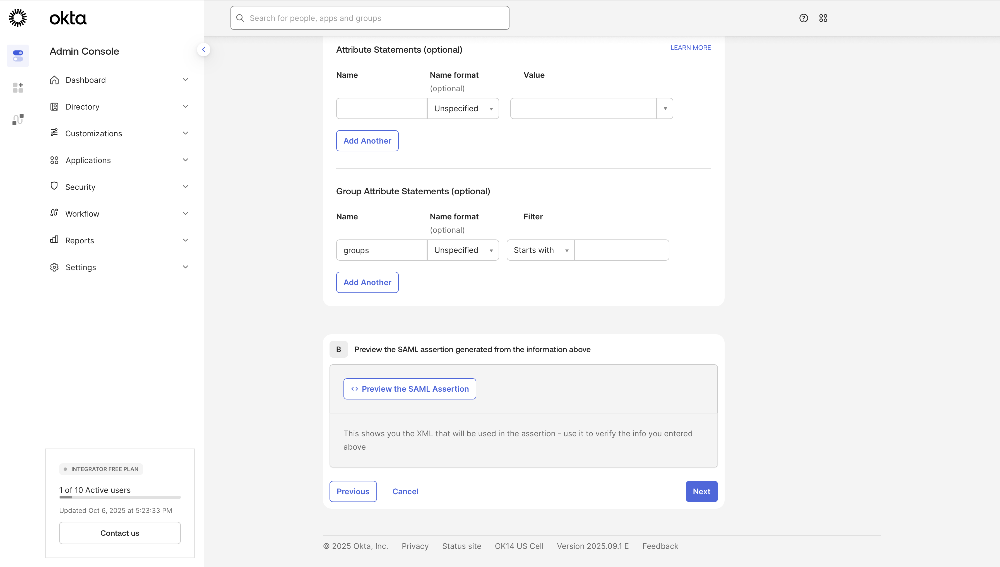

!!! Tip
    You can change the group attribute name from `groups` to something else if needed. If you do, make sure to update 
    the IdP Groups Attribute field in pfSense accordingly.

## Step 2: Assign users or groups to the application

Click **Next** and proceed through the rest of the setup. Once the application is created, you will need to assign users
or groups to the application so they can authenticate to pfSense. Click on the **Assignments** tab and then click
**Assign > Assign to People** or **Assign to Groups** as needed.

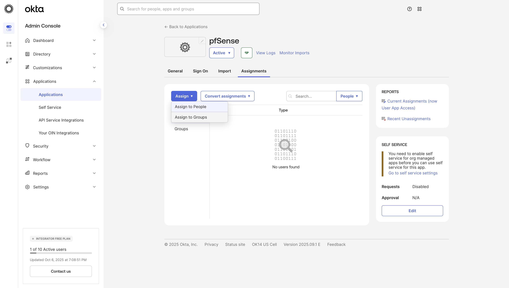

!!! Tip
    If you are using [group-based privilege mapping](../PRIVILEGE_MAPPING_BY_GROUP.md), it is recommended to assign 
    groups to the application rather than individual users. This ensures that any user added to the group in Okta will 
    automatically gain access to pfSense.

## Step 3: Retrieve Okta metadata

Next, you will need to retrieve some metadata from Okta to configure on pfSense. If you are planning on using a
metadata URL for auto-configuration, navigate to the **Sign On** tab of your application and find the **Metadata URL** 
link. Keep this URL handy as you will need it in the next step.

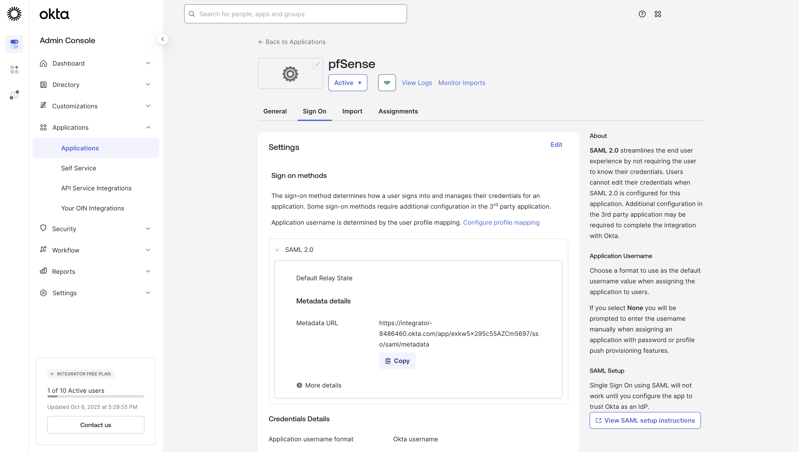

If you are _not_ using a metadata URL, you can find the individual metadata values you will need by clicking the
**View Setup Instructions** link on the **Sign On** tab. This should bring you to a page that displays the
**Identity Provider Single Sign-On URL**, **Identity Provider Issuer**, and the **X.509 Certificate**. Have these values
ready for the next step.

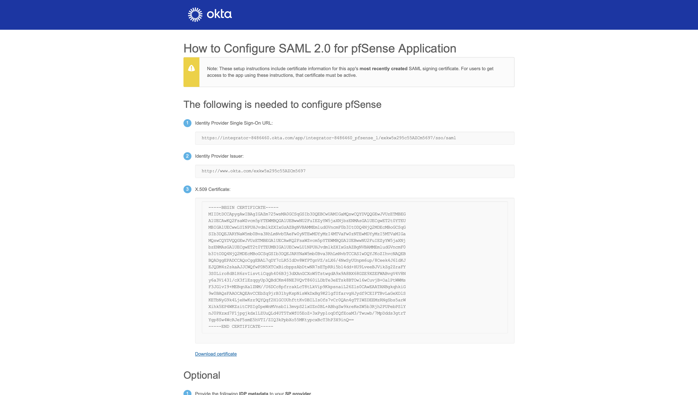

## Step 4: Configure SAML2 settings in pfSense

Now that you have the necessary information from Okta, sign in to your pfSense instance and navigate to **System > 
SAML2**. Ensure the following fields are set:

- **Enable**: Checked
- **Filter Email Usernames**: Checked
- **Identity Provider Metadata URL**: The Metadata URL from [Step 3](#step-3-retrieve-okta-metadata) if using auto-configuration.
- **Identity Provider Single Sign-On URL**: The Identity Provider Sign-On URL from [Step 3](#step-3-retrieve-okta-metadata) if not using a metadata URL.
- **Identity Provider Entity ID**: The Identity Provider Issuer from [Step 3](#step-3-retrieve-okta-metadata) if not using a metadata URL.
- **Identity Provider x509 Certificate**: The X.509 Certificate from [Step 3](#step-3-retrieve-okta-metadata) if not using a metadata URL.
- **SP Base URL**: `https://<PFSENSE IP OR FQDN>`

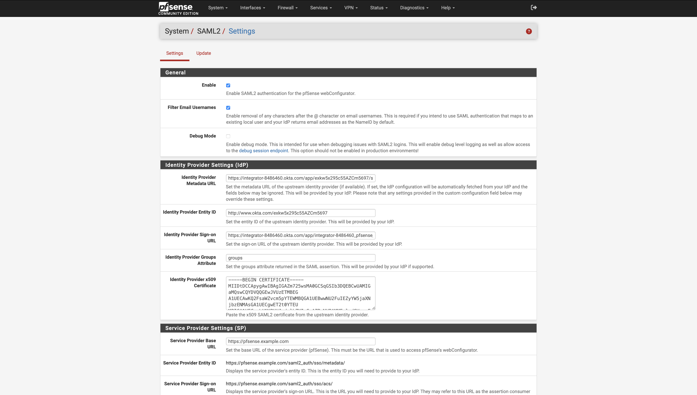

Click **Save** at the bottom of the page to apply your changes.

## Step 5: Create users or groups in pfSense

If you are using [group-based privilege mapping](../PRIVILEGE_MAPPING_BY_GROUP.md), navigate to **System > User 
Manager > Groups** and create remote-scoped groups that match those in Okta. Ensure the group names match exactly, 
including case sensitivity. Then assign the desired privileges to each group.

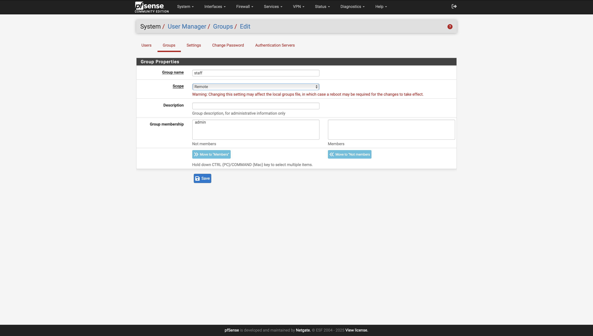

If you are using [user-based privilege mapping](../PRIVILEGE_MAPPING_BY_USER.md), navigate to 
**System > User Manager> Users** and create local users that match the usernames in Okta exactly. Assign the desired 
privileges to each user.

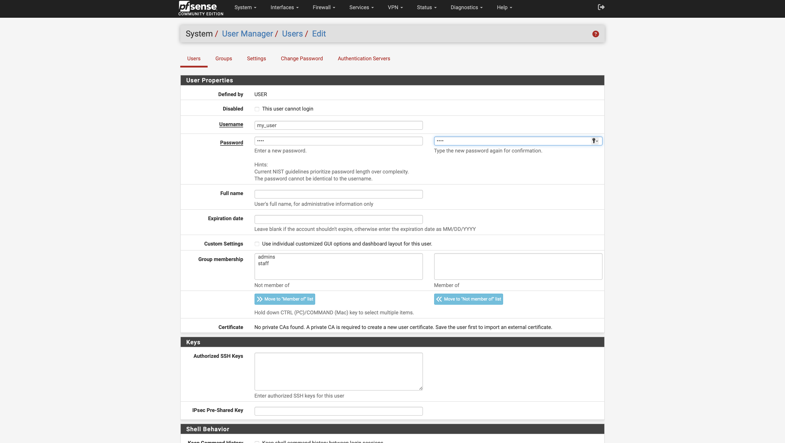

## Step 6: Test the configuration

On the pfSense login page, there should now be a **Sign In with SSO** link below the standard login form. Click this 
link to be redirected to Okta for authentication. Assuming everything is configured correctly, you should be redirected
back to pfSense and be logged in. If you encounter issues, you can enable the **Debug** option on the **System > SAML2** 
page to enable more detailed logging. The SAML2 logs can be found under **Status > System Logs > Packages > SAML2**.

Last updated: 2025-10-06

